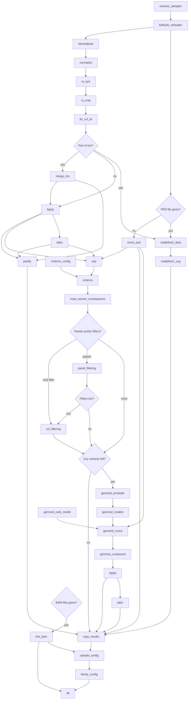

# Scout annotation workflow

Snakemake workflow for annotating VCFs prior loading into Scout.

## Setup

The package is managed using uv, and this can be used to install it as a tool, or just run it directly in the project directory:

```bash
uv sync
uv run scout-annotation
# or
uv tool install --python 3.12 .
```

> [!NOTE]
> Due to a [current limitation in uv](https://github.com/astral-sh/uv/issues/11624), the Python version restriction in `pyproject.toml` isn't fully respected.
> Therefore the version must be passed in when installing using `uv tool install`.

It can also be installed using pip. Just activate the environment you want to use and run:

```bash
python -m pip install .
```

Currently only Python 3.12 is supported.

## Running 

```bash
scout-annotation --help
# Usage: scout-annotation [OPTIONS] COMMAND [ARGS]...
#
# Options:
#   -c, --config TEXT               config file used for overwriting defaults
#   --cores INTEGER                 number of cores available for snakemake
#   --use-apptainer, --use-singularity
#                                   use apptainer as executor
#   --apptainer-args, --singularity-args TEXT
#                                   arguments for apptainer
#   --apptainer-prefix, --singularity-prefix TEXT
#                                   path to cached apptainer containers
#   --loglevel [DEBUG|INFO|WARNING|ERROR]
#                                   set logging level
#   --version                       Show the version and exit.
#   -h, --help                      Show this message and exit.
#
# Commands:
#   batch   Annotate a batch of samples.
#   panels  List available gene panels
#   single  Annotate a single sample.
#   trio    Annotate a trio of samples
```

## Testing

This package is managed by uv, and tests are implemented using pytest.

```bash
uv run pytest
```

Running the above will run both unit tests and an integration test.
Currently, the integration test is only expected to run properly on one of the RV servers where `/storage` is mounted.
If `/storage` is not found, the integration tests will be skipped.

## Rule graph


