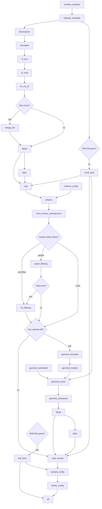

# Scout annotation workflow

Snakemake workflow for annotating VCFs prior loading into Scout.

## Setup

I recommend installing the package in a dedicated virtual environment.

```bash
python -m pip install .
scout-annotation --help
# Usage: scout-annotation [OPTIONS] COMMAND [ARGS]...
#
# Options:
#   -c, --config TEXT               config file used for overwriting defaults
#   -r, --resources TEXT            resources file for overwriting defaults
#   --cores INTEGER                 number of cores available for snakemake
#   --use-apptainer, --use-singularity
#                                   use apptainer as executor
#   --apptainer-args, --singularity-args TEXT
#                                   arguments for apptainer
#   --apptainer-prefix, --singularity-prefix TEXT
#                                   path to cached apptainer containers
#   --loglevel [DEBUG|INFO|WARNING|ERROR]
#                                   set logging level
#   --version                       Show the version and exit.
#   -h, --help                      Show this message and exit.
#
# Commands:
#   batch   Annotate a batch of samples.
#   panels  List available gene panels
#   single  Annotate a single sample.
#   trio    Annotate a trio of samples
```

## Testing

This package is best managed by poetry, and tests are implemented using pytest.

```bash
poetry install
poetry run pytest
```

Running the above will run both unit tests and an integration test.
Currently, the integration test is only expected to run properly on vs478.
All other tests can be run with

```bash
poetry run pytest --ignore tests/integration_test.py
```

## Rule graph


